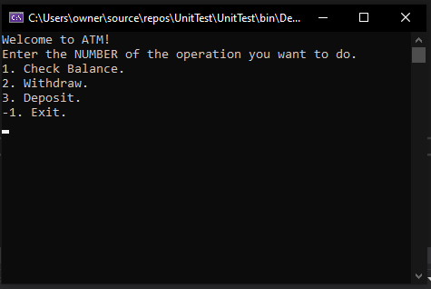

# Lab02-ATM 

### In this project I created an ATM program you can do some operations in it like :
> 1- View Your Balance.

> 2- Withdraw: You can not withdraw more than your balance and you can not withdraw minus values.

> 3- Deposite : You can not deposit less than 1$.

***The operations you can make it in program***

